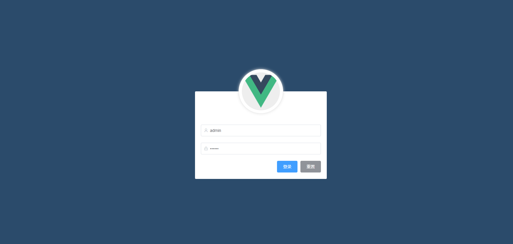
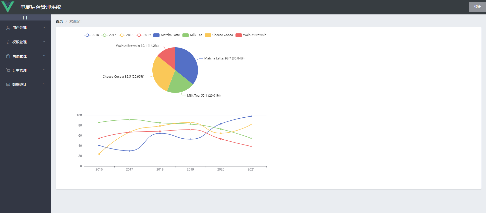
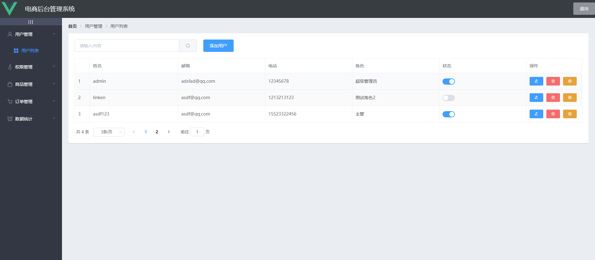
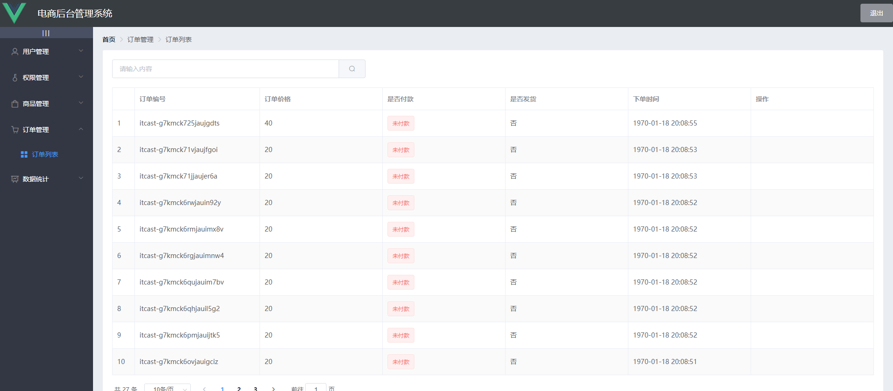
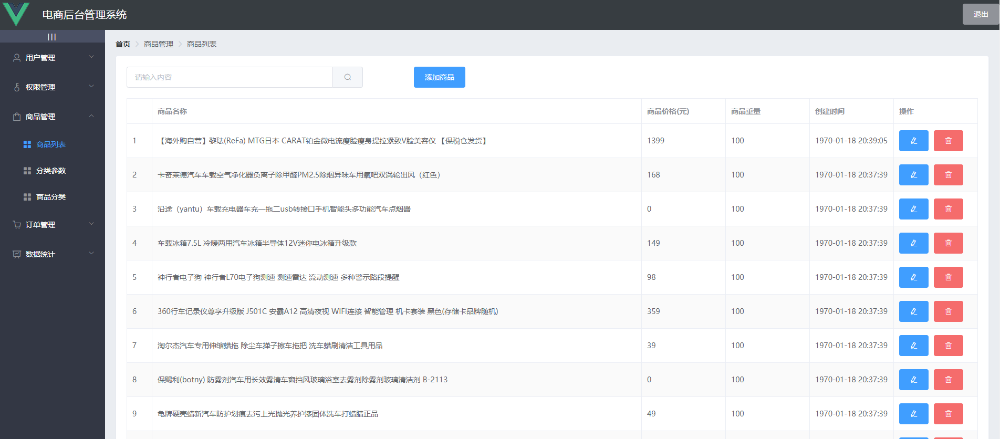
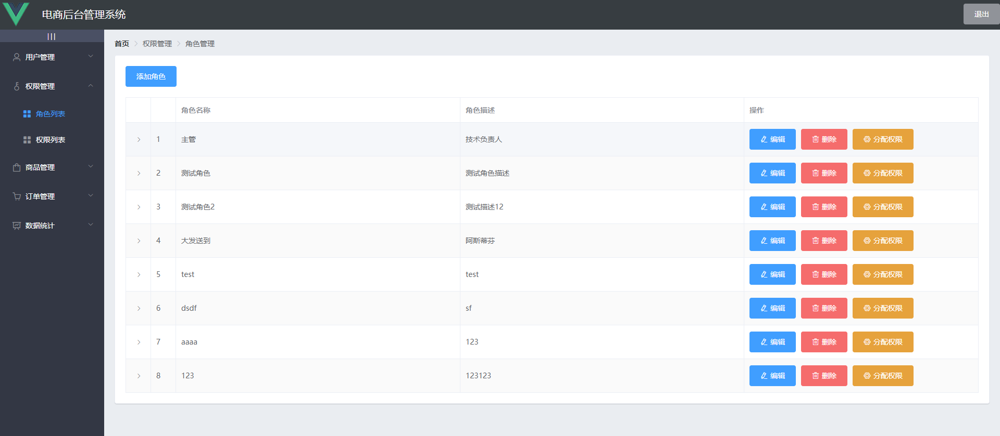
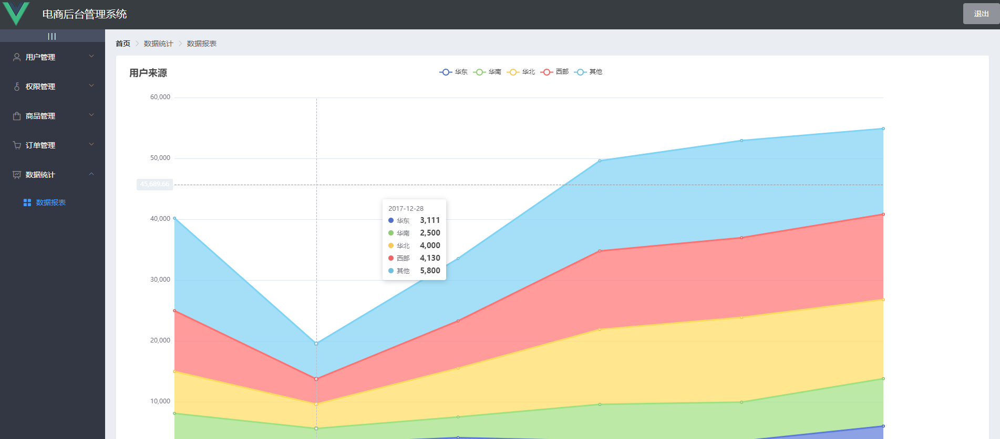

# vue_shop

## 前言
```
该项目为前后端分离项目的前端部分，后端部分届时上传：
```

## 项目介绍
`vue_shop`是一个电商管理系统的前端项目，基于Vue+Element实现。主要包括：用户管理、权限管理、商品管理、订单管理、数据统计、数据报表、角色、分类、商品等功能。

### 项目演示
项目在线演示地址：[http://www.bk725.top](http://www.bk725.top)

##### 登录页面


##### 页面首页


##### 用户管理


##### 权限管理


##### 商品管理


##### 订单管理


##### 数据统计


### 技术选型

技术 | 说明 | 官网
----|----|----
Vue | 前端框架 | [https://vuejs.org/](https://vuejs.org/)
Vue-router | 路由框架 | [https://router.vuejs.org/](https://router.vuejs.org/)
Element | 前端UI框架 | [https://element.eleme.io/](https://element.eleme.io/)
Axios | 前端HTTP框架 | [https://github.com/axios/axios](https://github.com/axios/axios)
v-charts | 基于Echarts的图表框架 | [https://v-charts.js.org/](https://v-charts.js.org/)
nprogress | 进度条控件 | [https://github.com/rstacruz/nprogress](https://github.com/rstacruz/nprogress)
vue-element-admin | 项目脚手架参考 | [https://github.com/PanJiaChen/vue-element-admin](https://github.com/PanJiaChen/vue-element-admin)

### 项目布局
```lua
src -- 源码目录
├── assets -- 静态图片资源文件
├── plugins -- element按需加载组件
├── router -- vue-router路由配置,懒加载模式
└── components -- 前端页面
    ├── login -- 登录页面
    ├── Welcome -- 首页
    ├── user -- 用户管理
    ├── power -- 权限管理
    ├── goods -- 商品管理
    ├── order -- 订单管理
    └── report -- 数据统计
public -- 源码目录
├── index.html -- 为了降低cli的大小.将所有加载文件放到index中
```
